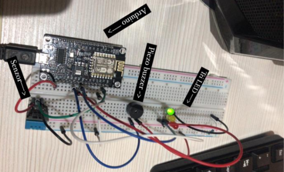
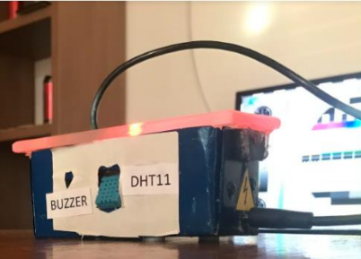

# EMINA - Emergency Mapping Interior Network Arduino

## Table of Contents
- [Overview](#overview)
  - [How It Works](#how-it-works)
  - [Features](#features)
  - [Schematics](#schematics)
  - [Built with](#built-with)
- [Links](#links)
- [Author](#author)

# Overview

EMINA - Emergency Mapping Interior Network Arduino is a compact device designed to protect your home in case of fire by sending notifications.

To complete the [Vatrodojava project](https://www.vatrodojava.rf.gd/), I developed an IoT system connected to the previously described application. As part of this, I created the "EMINA -> Emergency Mapping Interior Network Arduino" device designed for installation in enclosed spaces.

## How It Works

- The device connects to a WiFi network.
- If everything is fine, the device signals this with a green light.
- If the room temperature deviates from the defined limits, the device signals this with an audible signal at short intervals and a blue light.
- In case of fire, the audible signal becomes continuous, the device signals with a red light, and warnings are sent to the Online Vatrodojava application and Telegram.

## Features

- Preventive Action: Sends warning information to the Online Vatrodojava application or alerts via WhatsApp (phone number configured in the code) about room temperature increases.
- Components: Includes ESP8266 microcontroller, DHT11 temperature and humidity sensor, RGB LED for visual signals, and buzzer for audio signals, all housed in a metal casing with plexiglass covers.
- Smoke Sensor Recommendation: Note that using a smoke sensor instead of the DHT11 would enhance device functionality.

## Schematics

## Built with
  - ESP8266 microcontroller
  - DHT11 temperature and humidity sensor
  - RGB LED
  - Buzzer
  - Wires
  - Metal housing with plexiglass cover

## Links
- GitHub Repository - [EMINA GitHub](https://github.com/MuxBH28/emina)
- Online Vatrodojava Application - [Vatrodojava](https://sehic.rf.gd/vatrodojava)

## Author

- LinkedIn - [@Muhammed Šehić](https://www.linkedin.com/in/muhammed-%C5%A1ehi%C4%87-31a7b6175/)
- GitHub - [@MuxBH28](https://github.com/MuxBH28)
- Website - [www.sehic.rf.gd](https://sehic.rf.gd/)
- Contact - [Contact](https://sehic.rf.gd/#contact)
